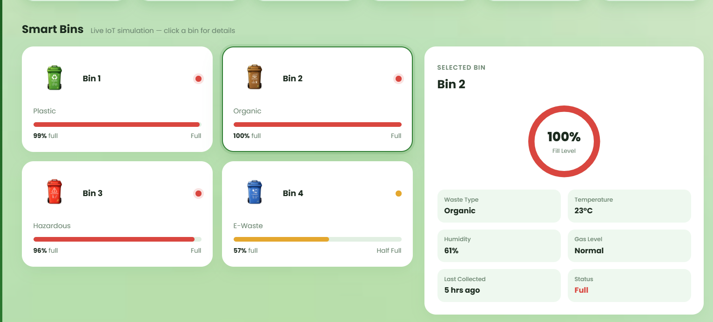
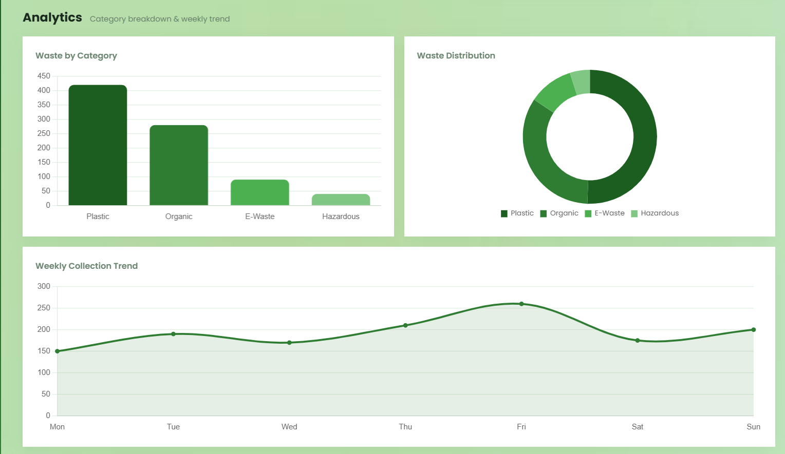

# EcoSort AI — Smart Waste Management Dashboard

An AI-powered waste management dashboard that classifies waste items from an image and simulates a network of smart IoT bins. Built for the IT Expo.
LIVE DEMO:
https://ecosort-ai-j54v.onrender.com


## Features

- **AI Waste Scanner** — upload or drop an image of a waste item; the backend classifies it (Plastic, Organic, Hazardous, E-Waste, or Others) with a confidence score and disposal tip.
- **Smart Bins** — live-simulated IoT bins showing fill level, temperature, humidity, and gas readings, with a detail panel per bin.
- **Analytics** — category breakdown and weekly collection trend charts (Chart.js).
- **Weekly Waste Summary** — animated count-up stats for waste collected by category and CO₂ saved.
- **Search** — filter bins by name, waste type, or status.

## Tech Stack

- **Frontend:** HTML, CSS, vanilla JavaScript, [Chart.js](https://www.chartjs.org/)
- **Backend:** Flask (Jinja templating, `/api/upload` endpoint)
- **AI Model:** _(fill in — e.g. name of image classification model/API used for waste detection)_

## Project Structure

```
├── templates/
│   └── index.html          # Main dashboard page
├── static/
│   ├── css/
│   │   └── style.css
│   ├── js/
│   │   ├── script.js        # Dashboard logic: bins, charts, search
│   │   ├── scanner.js        # AI Scanner logic: upload, preview, analyze, add to bin
│   │   └── chart.umd.min.js
│   └── images/
├── app.py                  # Flask app / API routes
└── README.md
```

## Getting Started

### Prerequisites

- Python 3.x
- Flask (`pip install flask`)
- _(any other dependencies your `/api/upload` route needs — e.g. `torch`, `tensorflow`, `pillow`, etc.)_

### Installation

```bash
git clone <your-repo-url>
cd ecosort-ai
pip install -r requirements.txt
```

### Running the app

```bash
python app.py
```

Then open **http://127.0.0.1:5000/** in your browser.

## How the AI Scanner Works

1. Choose an image via the file picker (`Choose Image`).
2. Click **Analyze Image** — the image is sent to `/api/upload` as `multipart/form-data`.
3. The backend returns:
   ```json
   {
     "item": "Banana Peel",
     "category": "Organic",
     "confidence": 0.99,
     "tip": "Compost banana peels to create nutrient-rich soil for your garden."
   }
   ```
4. The result is displayed with a matching disposal bin. Clicking **Add to Bin** logs the item and bumps that bin's simulated fill level (categories: Plastic, Organic, Hazardous, E-Waste — "Others" has no matching smart bin).

## Screenshots

### Dashboard


### AI Waste Scanner


### Smart Bins


### Analytics



## Real-World IoT Deployment

This project currently simulates IoT bin data on the frontend (see [Known Limitations](#known-limitations)), but it's built to mirror how a real deployment would work. Here's how EcoSort AI could function with actual smart bins in the field:

### Hardware Layer (per bin)
- **Ultrasonic distance sensor** (e.g. HC-SR04) — measures fill level by detecting distance from sensor to waste surface
- **Temperature & humidity sensor** (e.g. DHT22) — monitors internal bin conditions
- **Gas sensor** (e.g. MQ-135) — detects methane/harmful gas buildup from decomposing organic waste
- **Microcontroller** (e.g. ESP32 or Raspberry Pi Pico W) — reads sensor data and handles Wi-Fi/cellular connectivity
- **Camera module** (optional, e.g. ESP32-CAM) — captures images of deposited waste for AI classification at the bin itself, or a static scanning station near collection points

### Data Flow
```
[Bin Sensors] → [Microcontroller] → [MQTT/HTTP] → [Backend Server] → [Database] → [Dashboard]
```

1. Each bin's microcontroller reads sensor values on an interval (e.g. every 30–60 seconds).
2. Readings are published over MQTT (lightweight, ideal for IoT) or sent via HTTP POST to a backend endpoint.
3. The Flask backend stores incoming readings in a database (e.g. PostgreSQL/SQLite/InfluxDB for time-series data) instead of the in-memory `bins` array currently used in `script.js`.
4. The dashboard polls the backend (or uses WebSockets for true real-time push updates) to refresh bin cards and charts — replacing the current `setInterval` random-drift simulation.

### AI Scanner in Production
- The scanner could work two ways:
  1. **User-facing app/kiosk** — people photograph an item before disposing of it (as this prototype does), and the UI tells them which bin to use.
  2. **In-bin camera** — a camera at the bin's opening auto-captures and classifies every item as it's dropped in, logging it without user action.
- The classification model would run either on-device (edge inference on something like a Raspberry Pi with a lightweight model) or via a cloud inference endpoint, depending on latency/cost tradeoffs.

### Alerts & Automation
- Push notifications (email/SMS/app) when a bin crosses a fill threshold (e.g. 90%), triggering a collection request.
- Gas sensor readings above a safety threshold could trigger an immediate alert for hazardous bins.
- Route optimization for collection trucks based on real-time fill data across all bins, instead of fixed pickup schedules.

### What Would Need to Change From This Prototype
| Current (prototype) | Real deployment |
|---|---|
| `bins` array with random drift every 6s | Real sensor readings via MQTT/HTTP from physical bins |
| In-memory JS state | Persistent database with historical logging |
| Manual "Add to Bin" click | Automatic logging from in-bin camera/sensors |
| Single-user, single-session dashboard | Multi-user auth, per-facility/per-location bin groups |
| No real-time push | WebSockets or Server-Sent Events for live updates |

## Known Limitations

- Smart bin sensor data (temperature, humidity, gas, fill level) is simulated on the frontend, not from real hardware.
- "Others"/general waste items have no matching smart bin by design.
- The "Add to Bin" button stays disabled after logging until a new image is analyzed, to prevent double-logging the same item.

## Team

Built for the IT Expo by the **EcoSort AI Team**.

## License

_(add a license if you plan to share/open-source this, e.g. MIT)_